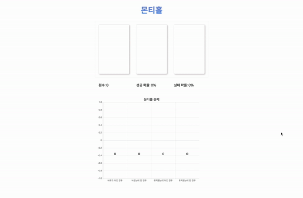

# 몬티홀

## [데모링크](https://skyepodium.github.io/montyhall/)

# 1. 문제
> 당신은, 자동차를 선택해야하는 퀴즈쇼에 들어왔습니다.

3개의 문이 있습니다. 
- 2개의 문에는 염소
- 1개의 문에는 자동차가 있습니다.

> 당신은 하나의 문을 선택했습니다.

그런데 사회자가 당신이 선택하지 않은 문중 하나를 열어서 염소가 들어있음을 보여주었습니다.

그리고 물어봅니다.

> 지금 선택한 문을 바꿀것인가요? 안바꿀 것인가요?

바꾸는 것이 수학적으로 유리하다고 합니다.

> 바꿨을 때 이길 확률: 66.6%
유지했을 때 이길 확률: 33.3%
